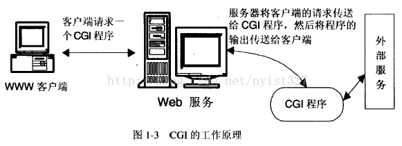

# Nginx 的特点

## Nginx作为HTTP服务器，有以下几项基本特性：

### 处理静态文件，索引文件以及自动索引，打开文件描述符缓冲


文件描述符：

* 在Linux系统中打开文件就会获得文件描述符，它是一个很小的非负数。
* 每个进程在PCB（process control block）中保存着一份文件描述符表，文件描述符就是这个表的索引，每个表项都有一个指向已经打开文件的指针。
* 在c语言中，可以通过open或create获得文件描述符，或通过父进程继承。
* 文件描述符也称句柄，Windows即称文件描述符为句柄。
* 标准输入，标注输出，标准错误输出也对应了三个文件描述符，分别为0，1，2 。
* 每个进程能持有的文件描述符数有限的，一般为65536



文件描述符的好处与坏处：

* **好处**

1. 基于文件描述符的I/O操作兼容POSIX（portable operating system interface of UNIX）标准
2. 在UNIX，LINUX的系统调用中，大量依赖文件描述符

* **坏处**

1. 非UNIX/LINUX的OS无法基于这个概念进行编程
2. 文件描述符时整数，不具备可读性



文件指针：

c语言中使用文件指针作为I/O的句柄。文件指针指向进程用户区中的一个被称为FILE结构的数据结构。FILE结构包括一个缓冲区和一个文件描述符。而文件描述符时文件描述符表的一个索引，因此从某种意义上说，文件指针就是句柄的句柄。



句柄：

指一种特殊的智能指针，当一个应用程序要引用其他系统，如数据库、操作系统所管理的内存块或对象时，就要使用句柄



文件描述符缓冲：

Nginx缓存会将最近使用的文件描述符和相关元数据（如修改事件、大小等）存储在缓存中。

配置：

`open_file_cache #  存储缓存`

`open_file_cache_valid # 每隔一段时间验证open_file_cache中的元素`

`open_file_cache_min_uses # 最小访问次数，以将元素标记为活动使用`

`open_file_cache_errors # 启用缓存错误，访问资源错误Nginx也会报告错误`



Nginx缓存并不会缓存请求文件的内容


### 无缓存的后向代理加速，简单的负载均衡和容错


前向代理：

前向代理作为客户端的代理，将从互联网上获取的资源返回给一个或多个的客户端，服务端（如web服务器）只知道代理的IP地址而不知道客户端的IP地址。



反向代理：

服务器根据客户端的请求，从其关系的一组或多组后端服务器（如web服务器）上获取资源，然后再将这些资源返回给客户端，客户端只会得知反向代理的IP地址，而不知道再代理服务器后面的服务器簇的存在。



负载均衡：

负载均衡是一种计算机技术，用来在多个计算机（计算机集群）、网络连接、CPU、磁盘驱动或其它资源中分配负载，以达到最优化资源使用、最大化吞吐率、最小化响应事件，同时避免过载的目的。使用带有负载平衡的多个服务器组件，取代单一的组件，可以通过冗余提高可靠性。

负载平衡服务通常是由专门软件或硬件来完成。**主要作用是将大量作业合理地分摊到多个操作单元上进行执行，用以解决互联网架构中的高并发和高可用问题**。

* 负载均衡的最重要的一个应用时利用多台服务器提供单一服务
* 负载均衡器有各种各样的**工作调度算法**：最简单的时随机选择轮询，更高级的算法会考虑更多的相关元素。
* 高性能系统通常会使用多层负载均衡，另外专用的硬件负载均衡器以及纯软件负载均衡器
* 分发策略有两种：bowties（每层多条路径可选）、stovepipes（从上到下）
* 添加了负载均衡之后，需要注意用户会话的保存



负载均衡中用户会话的保存方案

1. 负载均衡器缓存会话——会导致负载问题
2. 发往同一个后台服务器——无法容错（故障转移）
3. 依据用户名、IP来分配服务器——但IP可能有变
4. 会话信息保存到数据库中——会增加数据库负载
5. 客户端自行保持会话信息——但会话数据可能过大。且存在安全问题



容错：

是指软件检测应用程序所运行的软件或硬件中发生的错误并从错误中恢复的能力，通常可以从系统的可靠性，可用性，可测性等几个方面来衡量。

fault tolerance，确切来说时容故障（fault），而并非错误（error）。例如在双机容错系统中，一台机器出现问题时，另一台机器可以取而代之，从而保证系统的正常运行。

其实是进行了**故障转移**。


### FastCGI，简单的负载均衡和容错


快速通用网关接口（Fast Common Gateway Interface）：

* 是一种让交互程序与web服务器通信的协议，FastCGI是早期的通用网关接口CGI的增强版
* 致力于减少web服务器与CGI程序之间交互的开销，从而使服务器可以同时处理更多的请求
* CGI为每个请求创建一个进程，而FastCGI则用持续进程处理一连串的请求



通用网关接口（Common Gateway Interface）：

CGI是外部应用程序（CGI程序）与web服务器之间的接口标准，是在CGI程序与web服务器之间传递信息的过程。

CGI规定了web服务器以什么格式传什么数据给CGI程序。



CGI程序：

就有点类似php，jsp这些服务端脚本

在python的CGI编程中，可以直接在python文件中print html代码，生成相应的页面。




### 模块化的结构，包括gzipping，byte ranges，chunked responses，以及SSI-filter等filter。如果由FastCGI或其它代理服务器处理但也存在的多个SSI，则这项处理可以并行运行，而不需要互相等待。


SSI（Server Side Include）：

服务端包含，是一种类似于ASP的基于服务器的网页制作技术，将文本，图形或应用程序信息包含到网页。



gzip：

是一种流行的数据压缩程序，减少浏览器与web服务器之间的数据传输，可以让数据量更小，速度更快，但对于一些图像文件，压缩效果就不那么明显。



byte ranges：

html5提供了一个range标签来实现文件的分段下载，nginx也要设置才能允许range标签返回。



chunked responses：

chunked transfer encoding是超文本传输协议（HTTP）中的一种数据传输机制，允许HTTP由服务器发送给客户端应用（通常是网页浏览器）的数据可以分成多个部分。分块传输编码只在HTTP协议1.1版本提供。此时content-length的长度就不固定了。

Nginx也要进行相应的设置才能允许此功能。


### 支持SSL和TLS SNI


SSL（Secure Socket Layer，安全套接层）和TLS（Transport Layer Security，传输层安全性协议）：

TLS是SSL的延续，两者都是一种安全协议，目的是为互联网通信提供安全及数据完整性保障。

SSL包含记录层（Record Layer）和传输层，记录层确定传输层数据的封装格式。传输层安全协议使用X.509认证，之后利用非对称加密演算来对通信方做身份认证，之后交换对称密钥作为会话密钥（session key）。这个会话密钥是用来将通信两方交换的数据做加密的，保证两个应用间通信的保密性和可靠性，使得客户与服务器应用之间的通信不会被攻击者窃听。




SNI（Server Name Indication，服务器名称指示）：

是为了解决一个服务器使用了多个域名和证书的SSL/TLS扩展。它允许客户端在发起SLL握手请求时提交请求中的**主机名**，使得服务器能够**切换到正确的域并返回相应的证书**。



证书：

又称数字证书（digital certificate）、公钥证书，公开密钥证书，公开密钥认证（public key certificate），电子证书或安全证书，是用于公开密钥基础建设的电子文件，用来证明公开密钥持有者的身份。（服务端、客户端都可以由自己的证书）


### 支持内核poll模型，能支持高达5W个并发连接数


IO多路复用：

是指内核一旦发现进程指定的一个或多个IO条件准备读取，它就通知该进程。

IO多路复用适用如下场合：

1. 当客户处理多个描述字时（一般时交互式输入和网络套接口）
2. 当一个客户同时处理多个套接口时
3. 一个TCP服务既要监听套接口，又要处理已连接套接口时
4. 一个服务既要处理TCP，又要处理UDP时
5. 一个服务器要处理多个服务或多个协议时

与多进程和多线程技术相比，IO多路复用技术的最大优势时系统开销小，系统不必创建进程/线程，也不必维护这些进程/线程，从而大大减少了系统的开销。



select：

准许进程指示内核等待多个事件中的任何一个发送，并只在有一个或多个事件发生或经历一段指定的时间后才唤醒。

**函数原型如下：**

```c
int select(int maxfdp1,fd_set *readset,fd_set *writeset,fd_set *exceptset,const struct timeval *timeout)
```

maxfdp1：指定待测试的描述字个数，它的值时待测试的最大描述字加一

readset、writeset和exceptset：指定我们要让内核测试读、写和异常条件的描述字。如果对其中一个不感兴趣可以设置为空指针。

struct：fd\_set可以理解为一个集合，这个集合中存放的是文件描述符，可以通过以下四个宏进行设置：

```c
void FD_ZERO(fd_set *fdset);           //清空集合
void FD_SET(int fd, fd_set *fdset);    //将一个给定的文件描述符加入集合之中
void FD_CLR(int fd, fd_set *fdset);    //将一个给定的文件描述符从集合中删除
int FD_ISSET(int fd, fd_set *fdset);   // 检查集合中指定的文件描述符是否可以读写
```

timeout：告知内核等待所指定描述字中的任何一个就绪可花多少时间，其timeval结构用于指定这段时间的秒数和微妙数

```c
struct timeval{
       long tv_sec;   //seconds
       long tv_usec;  //microseconds
};
```

这个参数有三种可能：

1. 永远等下去：仅在有一个描述字准备好I/O时才返回。为此，把该参数设置为空指针
2. 等待一段固定时间：在有一个描述字准备好I/O时返回，但不超过由该参数所指向的timeval结构中指定的秒数和微妙数
3. 根本不等待：检查描述字后立即返回，这称为轮询。为此，该参数必须指向一个timeval结构，而且其中的定时器值必须为0




poll：

poll的机制与select类似，管理多个描述符也是进行轮询，根据描述符的状态进行处理，但是poll没有最大文件描述符数量的限制。

poll和select同样存在的一个缺点是：包含大量描述符的数组被整体复制于用户态和内核的地址空间之间，而不论这些文件描述符是否就绪，它的开销随着文件描述符数量的增加而线性增大。

**函数原型：**

```c
int poll ( struct pollfd * fds, unsigned int nfds, int timeout);
```

pollfd结构体定义如下：

```c
struct pollfd {
       int fd;               /* 文件描述符 */
       short events;         /* 等待的事件 */
       short revents;        /* 实际发生了的事件 */
} ; 
```

fd：一个被监视的文件描述符

events：监视该文件描述符的事件掩码，由用户来设置

revents：时文件描述符的操作结果事件掩码，内核在调用返回时设置，events中请求的任何事件都可能在revents中返回，合法的事件如下：

* POLLIN：有数据可读
* POLLRDNORM：有普通数据可读
* POLLRDBAND：有优先数据可读
* POLLPRI：有紧迫数据可读
* POLLOUT：写数据不会导致阻塞
* POLLWRNORM：写普通数据不会导致阻塞
* POLLWRBAND：写有优先数据不会导致阻塞
* POLLMSGSIGPOLL：消息可用

此外，revents域中还可能返回下列事件：

* POLLER：指定的文件描述符发生错误
* POLLHUP：指定的文件描述符挂起事件
* POLLNVAL：指定的文件描述符非法

这些事件在revents域中无意义，因为它们在合适的时候总会从revents中返回。

在poll\(\)返回时，检查revents中的事件标志，如果某一事件被设置了，则执行相应的操作。

timeout：指定等待的毫秒数，无论I/O是否准备好，poll都会返回：

1. 负值：无限超时，使poll\(\)一直挂起直到一个指定事件发生
2. 0：poll调用立即返回，并列出准备好I/O的文件描述符，但不等待其它的事件

**返回值和错误代码：**

成功：返回revents域不为0的文件描述符个数，若超时前没有任何事件发生，poll\(\)返回0

失败：返回-1，并设置error为下列值之一：

* EBADF：一个或多个结构体中指定的文件描述符无效
* EFAULTfds：指针指向的地址超出进程的地址空间
* EINTR：请求的事件之前产生一个信号，调用可以重新发起
* EINVALnfds：参数超出PLIMIT\_NOFILE值
* ENOMEM：可用内存不足，无法完成请求



**select和poll的基本流程：**

1. 复制用户数据到内核空间
2. 估计超时时间
3. 遍历每个文件并调用f\_op-&gt;poll取得文件当前就绪状态，如果前面遍历的文件都没有就绪，向文件插入wait\_queue节点
4. 遍历完成后检查状态：

   `a)如果已经有就绪的文件转到5；`

   `b)如果由信号产生，重启poll或select（转到1或3）；`

   `c)否则挂起进程等待超时或唤醒，超时或被唤醒后再次遍历所有文件取得每个文件的就绪状态`

5. 将所有文件的就绪状态复制到用户空间
6. 清理申请的资源




select\(\)和poll\(\)的差别

1. 不需要显示地请求异常情况报告
2. poll没有对fd的限制，select一般为1024或2048



epoll

是select和poll的增强版本，没有描述符限制，epoll使用一个描述符管理多个描述符，将用户关联的文件描述符的事件存放到内核的一个事件表中，这样在用户空间和内核空间的copy只需一次。

**epoll接口：**

```c
int epoll_create(int size);
int epoll_ctl(int epfd, int op, int fd, struct epoll_event *event);
int epoll_wait(int epfd, struct epoll_event * events, int maxevents, int timeout);
```

1. epoll\_create：创建一个epoll的句柄，size用来告诉内核这个监听的数目一共有多大。这个参数不同于select\(\)中的第一个参数，给出最大监听的fd+1值。需要注意的是，当创建好epoll句柄后，它就只会占用一个fd值，在Linux下如果查看/proc/进程id/fd/，是能够看到这个fd的，所以在使用完epoll后，必须调用close\(\)关闭，否则可能导致fd被耗尽。
2. epoll\_ctl：epoll的事件注册函数，它不同于select\(\)实在监听事件时告诉内核要监听的事件类型，而是在这里先注册要监听的事件类型，参数介绍如下：
   * epfd：epoll\_create的返回值
   * op：表示动作，可以用三个宏表示：

     `EPOLL_CTL_ADD：注册新的fd到epfd中`

     `EPOLL_CTL_MOD：修改已经注册的fd的监听事件`

     `EPOLL_CTL_DEL：从epfd中删除一个fd`

   * fd：需要监听的fd
   * event：需要监听的事件，events可以是以下几个宏的集合：

     `EPOLLIN：表示对应的文件描述符可以读（包括对端socket正常关闭）`

     `EPOLLOUT：表示对应的文件描述符可以写`

     `EPOLLPRI：表示对应的文件描述符有紧急的数据可以读`

     `EPOLLERR：表示对应的文件描述符发生错误`

     `EPOLLHUP：表示对应的文件描述被挂断`

     `EPOLLET：将EPOLL设置为边缘触发（Edge Triggered）模式，这是相对于水平触发（Level Triggered）来说的`

     `EPOLLLONESHOT：只监听一次事件，当监听完这次事件之后，如果还需要继续监听这个socket的话，需要再次把这个socket加入到EPOLL队列里`

     struct epoll\_event结构如下：

     ```c
     struct epoll_event {
       __uint32_t events;  /* Epoll events */
       epoll_data_t data;  /* User data variable */
     };
     ```
3. epoll\_wait：等待事件的产生，类似于select\(\)的调用。该函数返回需要处理的事件数目，若返回0则表示已经超时。参数介绍如下：
   * events：用来从内核得到事件的集合
   * maxevents：告之内核这个events有多大，不能大于epoll\_create\(\)时的size
   * timeout：超时事件（0：立即返回，-1无限等待）

**工作模式：**

epoll对文件描述符的操作有两种模式：LT（level trigger）和ET（edge trigger）。LT模式是默认模式，LT模式与ET模式的区别如下：

* LT模式：当epoll\_wait检测到描述符事件发生并将此事件通知应用程序，应用程序可以**不立即处理该事件**。下次调用epoll\_wait时，**会再次响应**应用程序并通知此事件。
* ET模式：当epoll\_wait检测到描述符事件发生并将此事件通知应用程序，应用程序必须**立即处理该事件**。如果不处理，下次调用epoll\_wait时，**不会再次响应**应用程序并通知此事件。

ET模式在很大程度上减少了epoll事件被重复触发的次数，因此效率要比LT模式高。epoll工作在ET模式的时候，必须使用非阻塞套接口，以避免由于一个文件句柄的阻塞读或阻塞写操作把处理多个文件描述符的任务饿死。



epoll和select与poll的区别：

select和poll都是不知道哪个文件就绪了，需要不断地无差别轮询所有fd，获取就绪状态，代码：

```c
while true { 
    select(streams[]) 
    // 不断轮询，找有数据的流
    for i in streams[] { 
        if i has data {
            read until unavailable 
        }
    } 
}
```

而epoll，可以理解为event poll，epoll也需要轮询事件表，但是事件表中的发生事件的fd是事件发生时，通过回调函数放入事件表中的，无需调用者无差别轮询，而且其中的fd也一般不是整个fd集合，代码：

```c
while true {
    active_stream[] = epoll_wait(epollfd)
    // 只关注发生了某些事件被激活的流
    for i in active_stream[] {
        read or write till
    }
}
```

另外，select和poll**每次调用**都要把fd集合从用户态往内核态拷贝一次，并且要把current往**设备等待队列**中挂一次，而epoll只要拷贝一次，而且把current往**等待队列**上挂也只挂一次（epoll的等待队列不同于设备等待队列，知识epoll内部定义的等待队列而已）。这也能节省不少开销。


### 采取了分阶段资源分配技术，使得它的CPU与内存的占用率非常低


分阶段资源分配技术：

即根据需求的阶段性分配资源，而不是一次调用全部请求资源，减少系统资源占用和系统负载


### 支持热部署，能够在不间断服务的情况下，对软件版本进行升级


热部署：

就是在应用正在运行的时候升级软件，却不需要重启应用

一般来说，热部署实现有几个要点：

1. 监听文件变化
2. 删除原先的应用程序，重新部署新的应用程序


### 采用master-slave模型，能够充分利用SMP的优势，且能够减少工作进程在磁盘I/O的阻塞延迟。当采用select\(\)/poll\(\)调用时，还可以限制每个进程的连接数


master-slave模型：

即主从模式，核心思想是基于分而治之的思想，将一个原始任务分解为若干个语义等同的子任务，并由专门的工作者线程来并行执行这些任务，原始任务的结果是通过整合各个子任务的处理结果形成的，主要的使用场景有：

* 并行计算，以提高计算性能
* 容错处理，以提升计算的可靠性
* 计算精度，以提高计算的精确程度

在分布式的系统中，这个模式还是比较常用的，简单来说，主-从和进程-线程的关系类似，只有一台机器作为master，其他机器作为slave，这些机器同时运行组成了集群。master作为任务调度者，给多个slave分配计算任务，当所有的slave将任务完成之后，最后由master汇集结果。

优缺点：

优点：准确性——将服务的执行委托给不同的从设备，具有不同的实现

缺点：从设备是孤立的，没有共享的状态。主-从通信中的延迟可能是一个问题，例如在实时系统中，这种模式只能应用于可以分解的问题。



SMP（Symmetrical Multi-Processing，对称多处理）：

是指在一个计算机上汇集了一组处理器（多CPU），各CPU之间共享内存子系统以及总线结构。


### 具有强大的upstream与filter链。Upstream为诸如反向代理（reverse proxy），与其它服务器通信模块的编写奠定了很好的基础

Filter链的各个filter不必等待前一个filter执行完毕，它可以把前一个filter的输出作为当前filter的输入，这有点像Unix的管道。这意味着，一个模块可以开始压缩从后端服务器发送过来的请求，且可以在**模块接受完后端服务器的整个请求之前把压缩流转向客户端**


管道（pipeline）：

在类unix操作系统中，管道是一系列将标准输入输出链接起来的进程，其中每一个进程的输出被直接作为下一个进程的输入。每一个链接都由匿名管道实现。管道中的组成元素也称作过滤程序（filter）。


### 采用了一些os提供的最新特性，如sendfile（Linux2.2+）、accept-filter（FreeBSD4.1+）、TCP\_DEFER\_ACCEPT（Linux2.4+）的支持，从而大大提高了性能


sendfile：Linux中的“零拷贝”，减少数据拷贝操作，也减少了上下文切换，实现高效率传送文件



TCP\_DEFER\_ACCEPT：

Linux（以及其他的一些操作系统）在其TCP实现中包括了TCP\_DEFER\_ACCEPT选项。它们设置在侦听套接字的服务器方，该选项命令内核不等待最后的ACK包而是在第1个真正有数据的包到达才初始化侦听进程。



accept-filter是FreeBSD中的实现，效果和TCP\_DEFER\_ACCEPT几乎是一样的。



FreeBSD:

是一个类unix的操作系统


