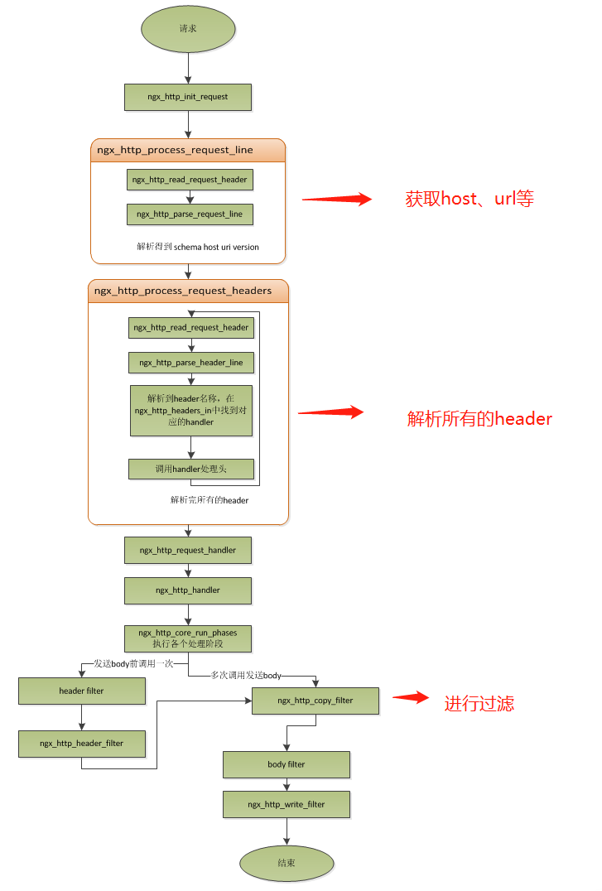

# Nginx 基础概念

## **connection**

nginx中的connection就是对tcp连接的封装，其中包括连接的socket、读事件、写事件。这样子进行封装之后，可以方便对connection的事件进行处理。

### nginx是如何处理一个连接的

1. 首先，nginx在启动时，会解析配置文件，得到需要监听的端口与ip地址，然后在nginx的master进程里面，先初始化好这个监控的socket（创建socket，设置addrreuse等选项，绑定到指定的ip地址端口，再listen） 
2. 然后，fork出多个子进程出来，然后子进程会竞争accept新的连接。此时，客户端就可以向nginx发起连接了。 
3. 当客户端与服务端通过三次握手建立好一个连接后，ngin的某一个子进程会accept成功，得到这个建立好的连接的socket，然后创建nginx对连接的封装，即`ngx_connection_t`结构体。 
4. 接着，设置读写事件处理函数并添加读写事件来与客户端进行数据的交换。 
5. 最后，nginx或客户端来主动关闭连接，一个连接就结束了。

### nginx也可以作为客户端

1. 先获取一个`ngx_connection_t`结构体，与其它server创建的连接封装在其中。
2.  创建socket，并设置socket属性（比如非阻塞）。 
3. 添加读写事件，调用connect/read/write来调用连接 
4. 关闭连接，并释放`ngx_connection_t`


nginx的每个worker保存一个独立的连接池，池的大小是`worker_connectons`，表示每个进程支持的最大连接数，不超过一个进程能够打开的fd的最大数。

连接池并不保存真正的连接，而是一个`worker_connectons`大小的`ngx_connection_t`结构的数组。并且，nginx会通过一个链表`free_connections`来保存所有空闲的`ngx_connection_t`，每次获得一个连接时，就从空闲连接链表中获取一个，用完后，再放回空闲连接链表里面。



nginx的最大连接数

请求本地资源时：

nginx的最大连接数 = worker\_connectons \* worker\_processes

作为反向代理时（因为此时，每个并发会建立与客户端的连接和与后端服务的连接，会占用两个连接）：

nginx的最大连接数 = worker\_connectons \* worker\_processes/2



nginx使用一个叫`ngx_accept_disabled`的变量去控制是否去竞争`accept_mutex`锁，因为锁的竞争可能会导致不公平，如果一个worker已经没有空闲的连接了，却又竞争到了锁，则无法处理这个连接，也无法移交，只能中止掉了。


## **request**

### nginx接收请求的过程

1. 处理请求行（为提升效率，使用状态机来解析请求行） 
2. 读取请求头（保存在一张链表中，并且针对特殊的请求有专门的函数进行处理） 
3. 处理请求（nginx的做法时先不读取请求body，到真正开始处理数据时，会执行多阶段请求处理；nginx将一个请求的处理分为多个阶段，分别处理不同阶段产生的数据。） 
4. 最后调用filter来过滤数据，对数据进行加工，如truncked传输，gzip压缩等。这里的filter是一个链表，包括header filter和body filter，会依次执行其中的所有filter。nginx最初的body信息，会在经过一系列的body filter处理之后，最后调用`ngx_http_write_filter`来进行输出。


请求行和请求头放在一个buffer里面，且存在于连续内存中，如果请求行超过一个buffer的大小，会返回414错误，如果请求头大于一个buffer大小，会返回400错误。buffer大小可以根据实际进行设置。


## **keepalive**


keepalive，长连接：

nginx支持长连接，有最大等待事件，超时会强行关闭。

一般来说，对于一个客户端的一次访问，需要多次访问同一个server时，打开keepalive的优势非常大，比如图片服务器，通常一个网页会包含很多个图片，打开keepalive也会大量减少time-wait的数量。


## **pipeline**

pipeline其实就是流水线作业，它是keepalive的一种升华，**pipeline也是基于长连接的**，目的就是一个连接**做多次请求**，对于keepalive来说，必须等待一个请求的响应接收完之后，才能发起另一个请求，而对于pipeline来说，可以在发送第一个请求后**立即发送第二个请求**。但是，nginx对pipeline**也不是并行处理**的，依然是一个请求接着一个请求处理，只是为了**减少等待第二个请求的请求头数据的时间**而已。

nginx的做法也很简单：在处理完前一个请求后，如果发现buffer里面还有数据，就认为剩下的数据是下一个请求的开始，接下来处理下一个请求，否则就设置keepalive。

## **lingering\_close**

延迟关闭，为了保持更好的客户端兼容性，但是却需要消耗更多的额外资源（比如连接会一直占着）。

