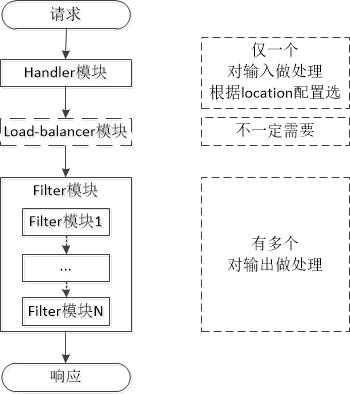

# Nginx源码结构分析

## Nginx 源码基本结构

解压了源码之后，会看到如下文件夹

```text
├── auto // 存放了大量脚本文件，与configure脚本程序有关
├── CHANGES
├── CHANGES.ru
├── conf // 存放的内容和Windows版本的同名目录相同
├── configure // 是Nginx软件的自动脚本程序，运行configure自动脚本一般会完成两项工作：一是检查环境，根据环境检查结构生成C代码；二是生成编译代码需要的Makefile文件
├── contrib
├── html // 存放的内容和Windows版本的同名目录相同
├── LICENSE
├── Makefile
├── man // 存放了Nginx软件的帮助文档，Nginx安装完成后，可以使用命令行查看 man nginx
├── objs
├── README
└── src
```

其中src即存放源代码的目录文件，组织结构如下：

```text
├── core：Nginx的核心源代码，包括常用数据结构以及Nginx内核实现的核心代码
├── event：Nginx事件驱动模型，以及定时器的实现相关代码
├── http：Nginx实现http服务器相关的代码
├── mail：Nginx实现邮件代理服务器相关的代码
├── misc：辅助代码，测试c++头的兼容性，以及对Google_PerfTools的支持
└── os：不同的系统结构所提供的系统函数的封装，提供对外统一的系统调用接口
```

下面针对最重要的三个目录进行简单的介绍：core目录、http目录、event目录

## core核心模块结构

core目录中的源码定义了Nginx服务器最基本的**数据结构**以及最基本的**核心模块**（核心模块**为其它模块提供了公共调用的基本功能**）。

代码结构：

```text
// 实现对个模块的整体控制，是Nginx程序main函数
├── nginx.c
├── nginx.h
// 基本数据结构及其操作
├── ngx_array.c
├── ngx_array.h
├── ngx_hash.c
├── ngx_hash.h
├── ngx_list.c
├── ngx_list.h
├── ngx_queue.c
├── ngx_queue.h
├── ngx_radix_tree.c
├── ngx_radix_tree.h
├── ngx_rbtree.c
├── ngx_rbtree.h
├── ngx_output_chain.c
├── ngx_buf.c
├── ngx_buf.h
// 整个Nginx模块架构基本配置管理
├── ngx_conf_file.c
├── ngx_conf_file.h
├── ngx_config.h
// 网络连接管理
├── ngx_connection.c
├── ngx_connection.h
// 定义一些头文件和结构别名
├── ngx_core.h
├── ngx_cpuinfo.c
// CRC校验表信息
├── ngx_crc32.c
├── ngx_crc32.h
├── ngx_crc.h
// 实现对系统运行过程参数、资源的通用管理
├── ngx_cycle.c
├── ngx_cycle.h
// 实现文件读写相关的功能
├── ngx_file.c
├── ngx_file.h
// socket网络套接字功能
├── ngx_inet.c
├── ngx_inet.h
// 实现日志输出、管理的相关功能
├── ngx_log.c
├── ngx_log.h
// hash字符串操作
├── ngx_md5.c
├── ngx_md5.h
├── ngx_murmurhash.c
├── ngx_murmurhash.h
// 内存管理相关文件
├── ngx_open_file_cache.c
├── ngx_open_file_cache.h
├── ngx_palloc.c
├── ngx_palloc.h
├── ngx_shmtx.c
├── ngx_shmtx.h
├── ngx_slab.c
├── ngx_slab.h
// PCRE上层封装
├── ngx_parse.c
├── ngx_parse.h
// 反向代理的协议信息 （这两个文件在1.4.2版本里面不存在）
├── ngx_proxy_protocol.c
├── ngx_proxy_protocol.h
// 实现支持正则表达式
├── ngx_regex.c
├── ngx_regex.h
// 字符串处理功能
├── ngx_string.c
├── ngx_string.h
// 时间获取与管理功能
├── ngx_times.c
├── ngx_times.h
// 其它文件
├── ngx_crypt.c
├── ngx_crypt.h
├── ngx_resolver.c
├── ngx_resolver.h
├── ngx_sha1.h
└──  ngx_spinlock.c
```

## event事件驱动模型结构

包含一种子目录module以及一些文件，除了module子目录，其它文件提供了**事件驱动模型相关数据结构**的**定义**、**初始化**、**事件接收**、**传递**、**管理**功能以及**事件驱动模型调用**功能。module子目录里面的源码**实现了Nginx支持的事件驱动模型**：AIO、epoll、kqueue、select、/dev/poll、poll等事件驱动模型。

```text
├── modules
│   ├── ngx_aio_module.c          // AIO事件驱动模型
│   ├── ngx_devpoll_module.c      // dev/poll事件驱动模型
│   ├── ngx_epoll_module.c        // epoll事件驱动模型
│   ├── ngx_eventport_module.c    // 事件驱动模型端口
│   ├── ngx_kqueue_module.c       // kqueue事件驱动模型
│   ├── ngx_poll_module.c         // poll事件驱动模型
│   ├── ngx_rtsig_module.c        // rtsing事件驱动模型
│   ├── ngx_select_module.c       // Linux下的select事件驱动模型
│   └── ngx_win32_select_module.c // Win32下的select事件驱动模型
├── ngx_event_accept.c
├── ngx_event_busy_lock.c
├── ngx_event_busy_lock.h
├── ngx_event.c
├── ngx_event_connect.c
├── ngx_event_connect.h
├── ngx_event.h
├── ngx_event_mutex.c
├── ngx_event_openssl.c
├── ngx_event_openssl.h
├── ngx_event_openssl_stapling.c
├── ngx_event_pipe.c
├── ngx_event_pipe.h
├── ngx_event_posted.c
├── ngx_event_posted.h
├── ngx_event_timer.c
└── ngx_event_timer.h
```

## http模块结构

http目录和event目录一样，包含了模块实现源码的module目录文件以及一些**结构定义**、**初始化**、**网络连接建立**、**管理**、**关闭**，以及**数据包解析**、**服务器组管理**等功能的源码文件。module目录文件实现了**HTTP模块的功能**。

```text
├── modules // 实现HTTP模块的功能
│   ├── ngx_http_access_module.c
│   ├── ngx_http_addition_filter_module.c
│   ├── ngx_http_auth_basic_module.c
│   ├── ngx_http_autoindex_module.c
│   ├── ngx_http_browser_module.c
│   ├── ngx_http_charset_filter_module.c
│   ├── ngx_http_chunked_filter_module.c
│   ├── ngx_http_dav_module.c
│   ├── ngx_http_degradation_module.c
│   ├── ngx_http_empty_gif_module.c
│   ├── ngx_http_fastcgi_module.c
│   ├── ngx_http_flv_module.c
│   ├── ngx_http_geoip_module.c
│   ├── ngx_http_geo_module.c
│   ├── ngx_http_gunzip_filter_module.c
│   ├── ngx_http_gzip_filter_module.c
│   ├── ngx_http_gzip_static_module.c
│   ├── ngx_http_headers_filter_module.c
│   ├── ngx_http_image_filter_module.c
│   ├── ngx_http_index_module.c
│   ├── ngx_http_limit_conn_module.c
│   ├── ngx_http_limit_req_module.c
│   ├── ngx_http_log_module.c
│   ├── ngx_http_map_module.c
│   ├── ngx_http_memcached_module.c
│   ├── ngx_http_mp4_module.c
│   ├── ngx_http_not_modified_filter_module.c
│   ├── ngx_http_proxy_module.c
│   ├── ngx_http_random_index_module.c
│   ├── ngx_http_range_filter_module.c
│   ├── ngx_http_realip_module.c
│   ├── ngx_http_referer_module.c
│   ├── ngx_http_rewrite_module.c
│   ├── ngx_http_scgi_module.c
│   ├── ngx_http_secure_link_module.c
│   ├── ngx_http_split_clients_module.c
│   ├── ngx_http_ssi_filter_module.c
│   ├── ngx_http_ssi_filter_module.h
│   ├── ngx_http_ssl_module.c
│   ├── ngx_http_ssl_module.h
│   ├── ngx_http_static_module.c
│   ├── ngx_http_stub_status_module.c
│   ├── ngx_http_sub_filter_module.c
│   ├── ngx_http_upstream_ip_hash_module.c
│   ├── ngx_http_upstream_keepalive_module.c
│   ├── ngx_http_upstream_least_conn_module.c
│   ├── ngx_http_userid_filter_module.c
│   ├── ngx_http_uwsgi_module.c
│   ├── ngx_http_xslt_filter_module.c
│   └── perl
├── ngx_http_busy_lock.c
├── ngx_http_busy_lock.h
├── ngx_http.c
├── ngx_http_cache.h
├── ngx_http_config.h
├── ngx_http_copy_filter_module.c
├── ngx_http_core_module.c
├── ngx_http_core_module.h
├── ngx_http_file_cache.c
├── ngx_http.h
├── ngx_http_header_filter_module.c
├── ngx_http_parse.c
├── ngx_http_parse_time.c
├── ngx_http_postpone_filter_module.c
├── ngx_http_request_body.c
├── ngx_http_request.c
├── ngx_http_request.h
├── ngx_http_script.c
├── ngx_http_script.h
├── ngx_http_spdy.c
├── ngx_http_spdy_filter_module.c
├── ngx_http_spdy.h
├── ngx_http_spdy_module.c
├── ngx_http_spdy_module.h
├── ngx_http_special_response.c
├── ngx_http_upstream.c
├── ngx_http_upstream.h
├── ngx_http_upstream_round_robin.c
├── ngx_http_upstream_round_robin.h
├── ngx_http_variables.c
├── ngx_http_variables.h
└── ngx_http_write_filter_module.c
```

## Nginx源码的模块化结构

根据各模块的功能，可以把Nginx源码划分为以下几种功能，如下图所示：



* 核心功能模块：为其它模块提供一些基本功能：字符串处理、时间管理、文件读写等功能
* 配置解析：主要包括文件语法检查、配置参数解析、参数初始化等功能
* 内存管理：内存池管理、共享内存的分配、缓冲区管理等功能
* 事件驱动：进程创建于管理、信号接收与处理、所有事件驱动模型的实现，高级IO等功能
* 日志管理：错误日志的生成与管理，任务日志的生成与管理功能
* HTTP服务：提供Web服务，包括客户端连接管理，客户端请求处理，虚拟主机管理，服务器组管理等功能
* Main服务：与HTTP服务类似，但是增加了邮件协议的实现

